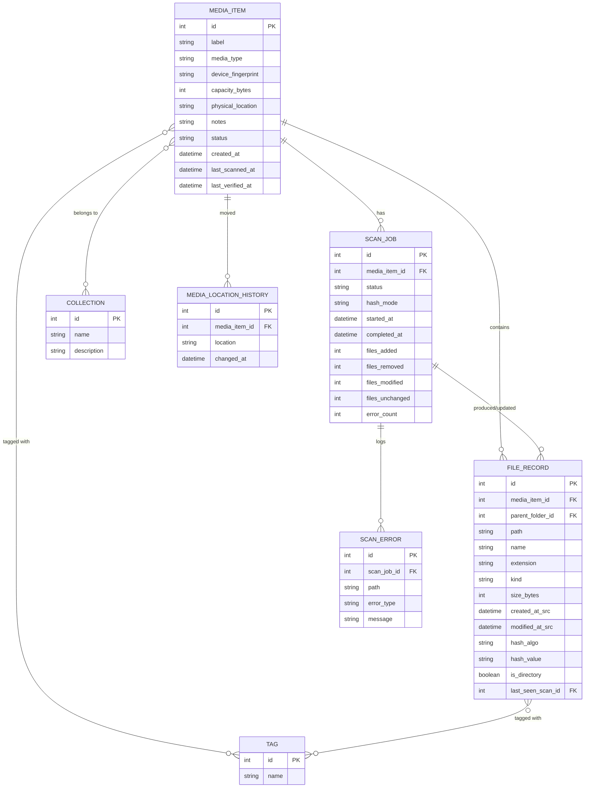

# Data Model

## 1. Entity-Relationship Diagram

## 2. Table Definitions

### `media_item`
| Column | Type | Notes |
|---|---|---|
| `id` | INTEGER PK | |
| `label` | TEXT | User-facing name |
| `media_type` | TEXT | CD, DVD, Blu-ray, USB, External HDD, External SSD, SD Card, Network Share, Other/custom |
| `device_fingerprint` | TEXT NULL | Filesystem UUID or composite label+size heuristic used to re-identify device on reconnect |
| `capacity_bytes` | INTEGER NULL | |
| `physical_location` | TEXT NULL | Free-form hierarchical string |
| `notes` | TEXT NULL | |
| `status` | TEXT | `active`, `retired`, `lost` |
| `created_at` | DATETIME | |
| `last_scanned_at` | DATETIME NULL | |
| `last_verified_at` | DATETIME NULL | Only updated when a hashing scan completes with no errors |

Indexes: `device_fingerprint`, `media_type`, `status`.

### `file_record`
| Column | Type | Notes |
|---|---|---|
| `id` | INTEGER PK | |
| `media_item_id` | FK → media_item.id | |
| `parent_folder_id` | FK → file_record.id NULL | Self-referential for folder tree |
| `path` | TEXT | Relative path from media root |
| `name` | TEXT | |
| `extension` | TEXT NULL | |
| `kind` | TEXT | Derived category: image, video, audio, document, archive, executable, other |
| `size_bytes` | INTEGER | 0 for directories |
| `created_at_src` | DATETIME NULL | Source filesystem timestamp |
| `modified_at_src` | DATETIME NULL | Source filesystem timestamp |
| `hash_algo` | TEXT NULL | `none`, `quick`, `sha256` |
| `hash_value` | TEXT NULL | |
| `is_directory` | BOOLEAN | |
| `last_seen_scan_id` | FK → scan_job.id | Used for diffing / staleness detection |

Indexes: `media_item_id`, `hash_value` (for duplicate detection), `extension`, plus an FTS5 virtual table `file_record_fts(name, path)` mirrored via triggers for full-text search.

### `scan_job`
| Column | Type | Notes |
|---|---|---|
| `id` | INTEGER PK | |
| `media_item_id` | FK | |
| `status` | TEXT | `queued`, `running`, `completed`, `cancelled`, `failed`, `incomplete` |
| `hash_mode` | TEXT | `none`, `quick`, `full` |
| `started_at` / `completed_at` | DATETIME | |
| `files_added` / `files_removed` / `files_modified` / `files_unchanged` | INTEGER | Diff summary vs. prior snapshot |
| `error_count` | INTEGER | |

### `scan_error`
Per-file error captured during a scan (`path`, `error_type` e.g. `permission_denied`/`io_error`/`unreadable_sector`, `message`).

### `tag`, `media_item_tag`, `file_record_tag`
Standard tag + join tables for many-to-many tagging of media items and (v1.1+) individual files.

### `collection`, `collection_media_item`
Collections as a named many-to-many grouping over media items.

### `media_location_history`
Append-only log of physical location changes for audit purposes.

## 3. Notes on Design Choices

- **No file contents stored** — only metadata and optional hash, keeping the DB small relative to catalogued media size.
- **Soft diffing via `last_seen_scan_id`** — allows detecting "removed" files (present in DB but not refreshed by the latest scan) without deleting history immediately; a grace period/config can decide when to prune vs. archive.
- **FTS5 for search** — chosen over LIKE-only queries for performance at scale (NFR-1.3).
- **SQLite chosen over a client-server DB** — single-file, zero-config, ideal for a local desktop tool; supports full DB file backup/restore trivially (FR-7.2).
